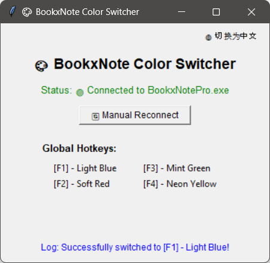

# BookxNote Color Trainer 🎨

[简体中文](README_ZH.md) | English



A lightweight, open-source tool that allows you to instantly switch pen colors in **BookxNote Pro** using global hotkeys. Built with Python, it edits the application's memory directly, keeping you in the flow while studying or taking notes.

### ⚠️ Compatibility Note
Memory pointers and base offsets are highly sensitive to software updates. This tool has been reverse-engineered and tested specifically for:
- **BookxNote Pro Version:** `3.0.0.2023 (64-bit)`

*Note: If the software updates, the pointer chain may break. You will need to rescan with Cheat Engine and update the `OFFSETS` in the source code.*

### ✨ Core Features
- **Global Hotkey Control:** Switch colors instantly using `F1`-`F4` without clicking through menus or losing focus on your document.
- **Standard Hex Color Support:** Configure your custom palette using standard web color codes (e.g., `#FF5733`) instead of calculating complex memory values.

### 🧠 How It Works (Under the Hood)
This tool operates via **direct memory editing**. 
By reverse-engineering the application, we mapped out the multi-level pointer chain that dictates the active pen color in BookxNote Pro. The Python script uses the `pymem` library to traverse this pointer chain in real-time to find the dynamic memory address. 

Additionally, it features a built-in conversion algorithm that takes standard 8-bit RGB Hex codes, doubles the channels to 16-bit, and rearranges them into the specific `BBGGRRFF` 64-bit integer format required by the software's memory architecture.

### 🚀 Usage

1. Install the required Python libraries:
   ```bash
   pip install pymem keyboard
   ```
2. Open **BookxNote Pro**.
3. Run the script from the `src` directory:
   ```bash
   python src/BookxNote_Color_Trainer.py
   ```
4. Press `F1`, `F2`, `F3`, or `F4` to change your pen color instantly!

### 🛠️ Customizing Colors
You can easily change the preset colors by editing the `COLORS` dictionary inside the source code. Just paste any standard Hex color code:

```python
COLORS = {
    "F1": hex_to_8byte_color("#59C6FF"), # Change this hex code to your liking!
    # ...
}
```

*Disclaimer: This project is for educational purposes and personal productivity enhancement only. It is not affiliated with BookxNote.*
